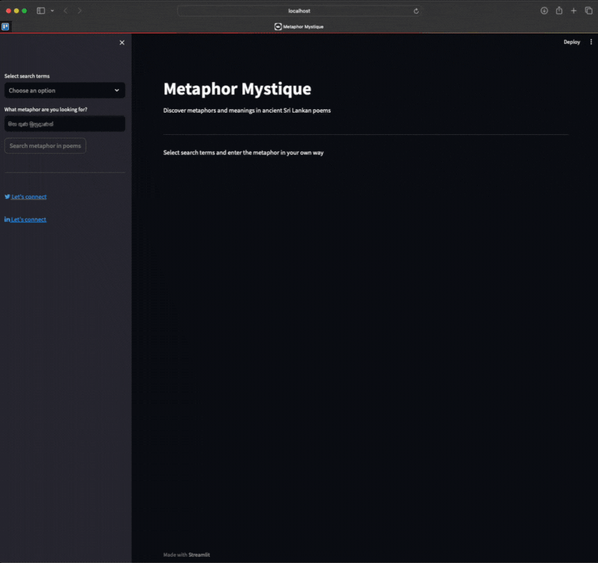
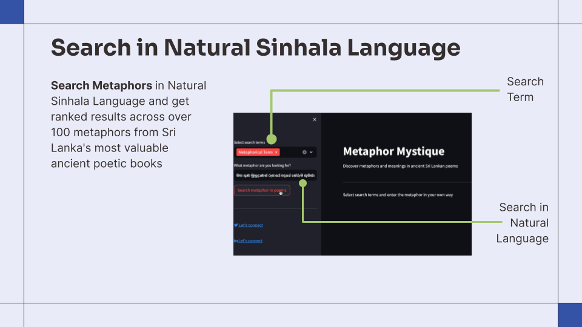
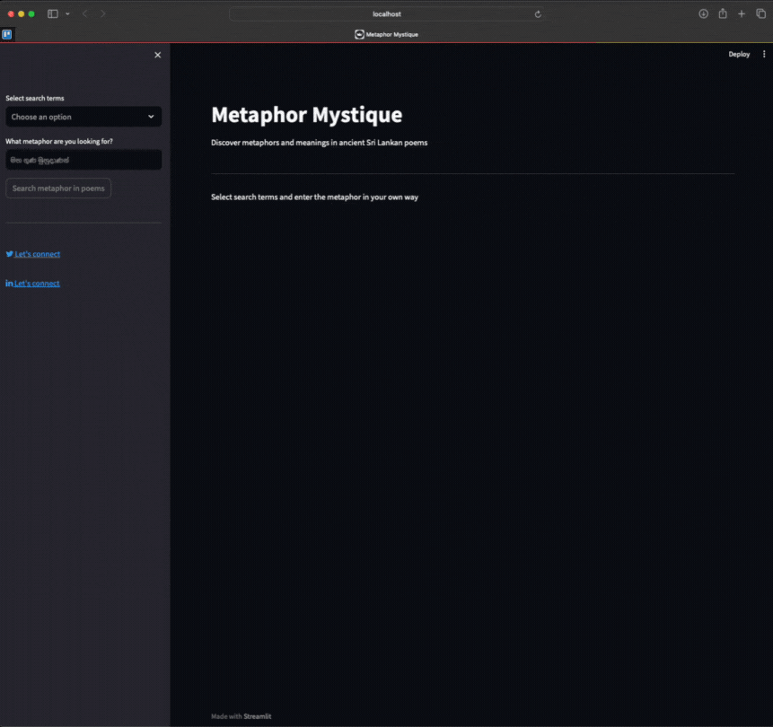
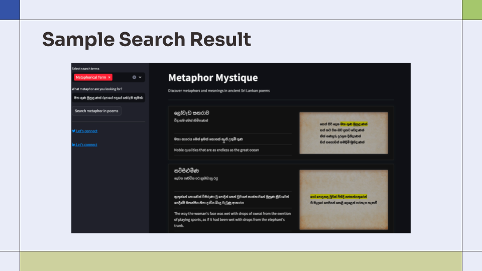

# Metaphor Mystique Search Engine


<h3 align="center" style="color: #333">Connect with me 🙂 <a href="https://www.nimsarafernando.com">Look me up! 🚀</a></h3>
<p align="center" style="display: flex; align-items: center; justify-content: center;">
<a href="https://linkedin.com/in/nimsara66" target="blank"></a>
&nbsp;&nbsp;&nbsp;&nbsp;&nbsp;
<a href="https://www.facebook.com/mihindukulasuria.fernando" target="blank"></a>
&nbsp;&nbsp;&nbsp;&nbsp;&nbsp;
<a href="https://instagram.com/nimsara_sudeepa" target="blank"></a>
</p>

## Introduction

Welcome to Metaphor Mystique, a metaphor search engine powered by <span style="background: yellow;">Semantic Similarity Search and Ranking</span>. You can search in Natural Sinhala Language accross 100 metaphors and meanings that has been compiled and prepared by me.



## Motivation

Use state-of-the-art [Sentence Transformers](https://huggingface.co/Ransaka/sinhala-roberta-sentence-transformer) for sentence embeddings and similarity search along with Elastic Search for better Information Retrieval and Ranking

## Key Features

### 1. Search in Natural Sinhala Language



### 2. Relevance Ranking

##### Use general search if you don't know what you are looking for


##### Utilize search terms if you know what you are looking for and get better ranking results



### 3. Meaning and Interpretation

In addition to displaying the metaphors themselves, Metaphor Quest offers in-depth explanations and interpretations of each metaphor. This helps users understand the cultural and historical significance behind the metaphors.



## Exciting Features Coming Soon - Retrieval Augmented Generation

Use text-generation trasformers to perform Summarization, Q&A, etc tasks on retrieved data

## Getting Started

Clone the repository and follow these steps to get started:

```bash
git clone https://github.com/nimsara66/metaphor-mystique.git
cd metaphor-mystique
npm install -g streamlit
streamlit run app.py
```

## Contributing

Feel free to contribute to this project! Your contributions and comments are welcome and appreciated.

1. Fork the repository
2. Create a new branch
3. Make your changes
4. Submit a pull request

## Copyrght

@2024 NIMSARA ALL RIGHTS RESERVED